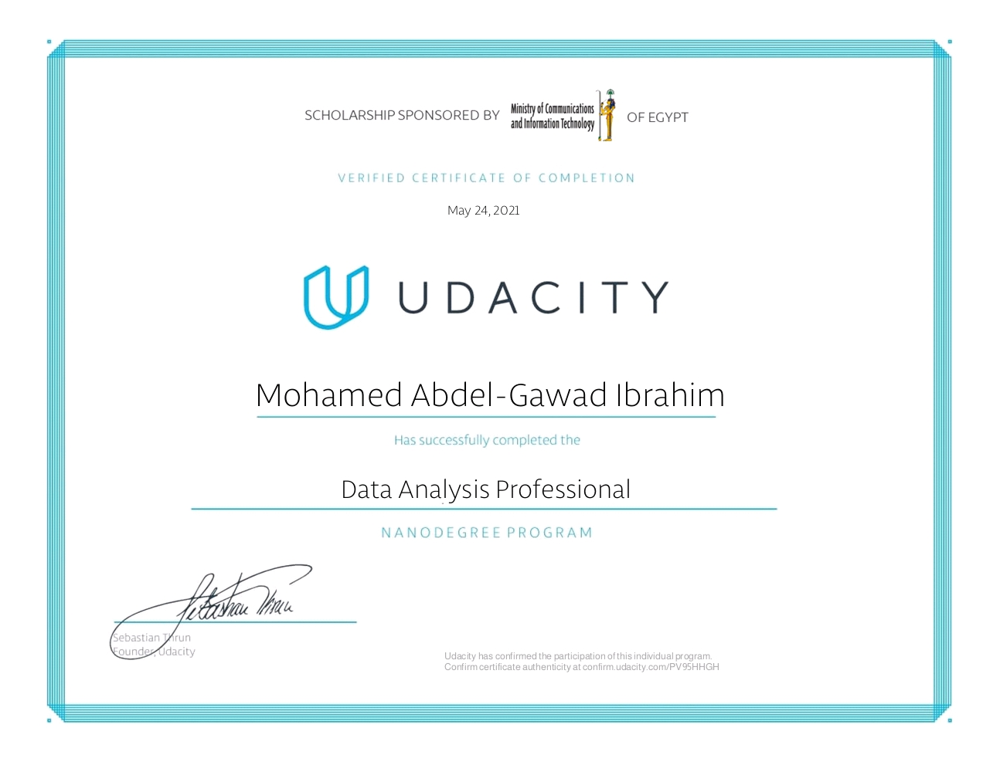

# Investigate European Soccer Database

## Project Overview

Exploring The ultimate Soccer database for data analysis and machine learning!
It contains data for soccer matches, players, and teams from several European countries from 2008 to 2016.

### The database includes:
+25,000 matches +10,000 players 11 European Countries with their lead championship Seasons 2008
to 2016 Players and Teams' attributes* sourced from EA Sports' FIFA video game series,
including the weekly updates This soccer database comes from Kaggle and is well suited for data analysis and machine learning.

* The database is stored in an SQLite database, and I accessed its files using the 'DB Browser(SQLite)' software.
* The dataset helped me practice my SQL joins skills.
* Some column titles were self-explanatory, while others I had to look up on Kaggle.

### We will explore the following questions in this project:

* What teams improved the most over time?
* Which players had the most penalties?
* Statistics of Players' Age
* Does The Age of a Player Affect His Overall Rating?
* Statistics of Players' Heights
* Does The height of a player Affect his Acceleration?
* Does The height of a player Affect his Heading Accuracy?
* Statistics of Players' Weight in Pounds
* Does The weight of a player Affect his Shot Power?
* Does The weight of a player Affect his Shot Power?

## Certification

This project was a milestone in my journey to study the Data Analysis Professional Nanodegree provided by Udacity.

## About The Author

* Author: Mohamed Abdel-Gawad Ibrahim
* Contact: muhammadabdelgawwad@gmail.com
* Phone: +201069052620 || +201147821232
